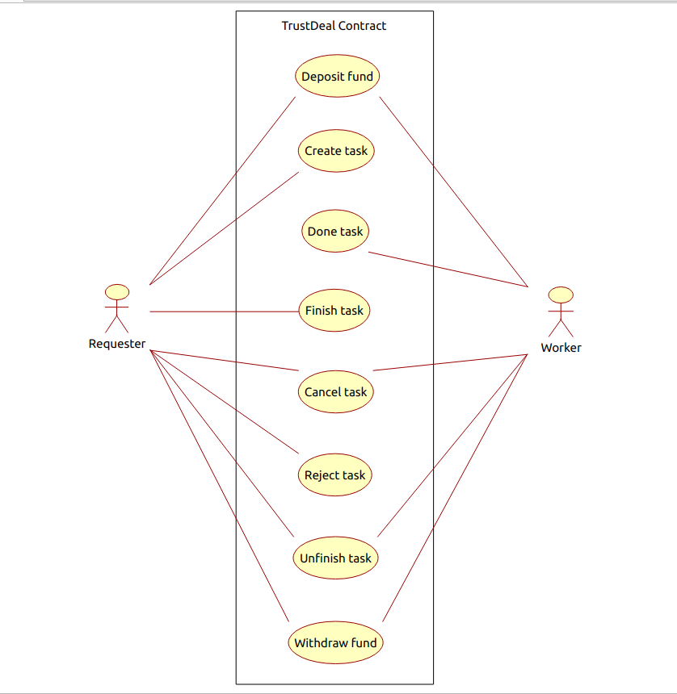
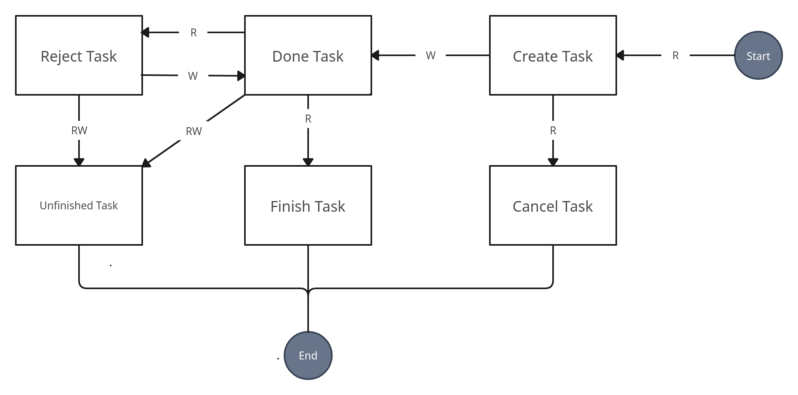

# TrustDeal

TrustDeal is a project that uses smart contracts to facilitate secure and fair exchanges between parties. It allows users to deposit and withdraw funds, create and join tasks or transfer the task as an NFT. the main goal is to increase trustworthiness in exchanges between individuals.

Users are divided into two general categories: worker and requester. here is the usecase diagram that shows how users can intract with this smart contract:

## How it works?

To increase reliability in exchanges, we have used a mechanism called <ins>proof of trust</ins>. both requester and worker lock an amount as a proof of trust in the smart contract and it is not returned to either party until the consent of both parties is obtained. most important entity is called <ins>Task</ins> which is considered as an NFT and it can have multiple states and is shown below:

1. Requester creates the task with salary and his proof of trust amount. also requester can specify the minimum value as proof of trust of the worker. the created task is then assigned to a dealer that can be the worker or someone else. this dealer is also specified by the requester.

2. Dealer can accept the task or assign it to someone else. the key point is that when the doer changes the status of the task to Done, he also locks an amount as proof of his honesty.

3. The requester has received the worker's service and can approve or reject it. if approved, the locked amounts will be released and the reward will be credited to the worker's account. If not approved, the worker will try again to satisfy the requester and then change the state of task to Done.

4. If for any reason there is a dispute between the two parties that could not be resolved, then one of the parties can change the status of the task to Unfinish, and in this case, while deducting a certain amount of loss according to an implemented algorithm, the locked amounts will be credited to the account of the parties.

This smart contract is designed to support different client-server construction models. in this case, non-important data is stored on the server side and important data (such as each person's money) is stored in the blockchain. The client can interact with the server and the blockchain at the same time. simple implementations of client and server model are stored in app and server directory. server is used to save non-important data of the task such as header and description.

## How to use?

1. Clone the project
    
        git clone https://github.com/Sepehr79/TrustDeal.git

2. Install and start ganache local blockchain as test blockchain

3. Intstall truffle

4. On the root directory type

        truffle migrate --network ganache

5. Open truffle desktop and copy the address of the TrustExchange smart contract to the contractAddress variable of ./app/trustdeal/src/App.js

6. Start the server on ./server/trustdeal using 

        ./mvnw spring-boot: run

7. Start the client on ./app/trustdeal using 

        npm start
    